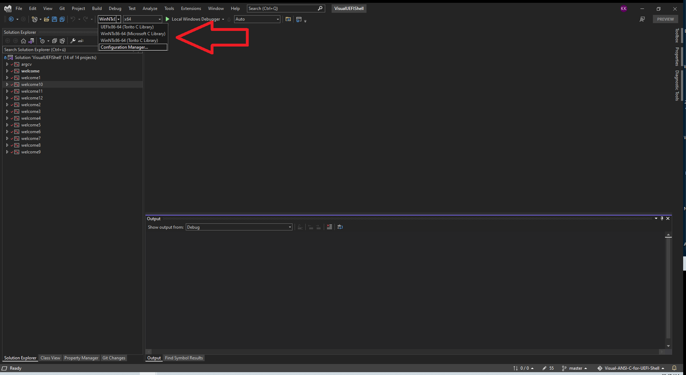

# Visual ANSI C for UEFI Shell

Getting started with Visual Studio 2022 for UEFI Shell and ANSI C cross-development.

## Projects/sample programs
| Project   |      Description      |
|:----------|:-------------|
|[ARGCV](argcv/argcv.c)   |argument count, argument vector, command line arguments|
|[WELCOME](welcome/welcome.c)   |simple `Hello, world`|
|[WELCOME1](welcome1/welcome1.c)   |simple `Hello, world` using `puts()`|
|[WELCOME2](welcome2/welcome2.c)   |simple `Hello, world` using `fprintf()` to STDERR and STDOUT each|
|[WELCOME3](welcome3/welcome3.c)   |simple `Hello, world` using `fputs()` to STDERR and STDOUT each|
|[WELCOME4](welcome4/welcome4.c)   |simple `Hello, world` using `fwrite()` to STDERR and STDOUT each|
|[WELCOME5](welcome5/welcome5.c)   |simple `Hello, world` using `putc()` to STDERR and STDOUT each|
|[WELCOME6](welcome6/welcome6.c)   |simple `Hello, world` using `fputc()` to STDERR and STDOUT each|
|[WELCOME7](welcome7/welcome7.c)   |simple `Hello, world` using all possible functions to STDOUT only|
|[WELCOME8](welcome8/welcome8.c)   |simple `Hello, world` for KARAOKE purpose|
|[WELCOME9](welcome9/welcome9.c)   |demonstration of `CTRL-C`and how to catch it in an ANSI/STANDARD C program|
|[WELCOME10](welcome10/welcome10.cpp) |demonstration *global Classes* in C++|
|[WELCOME11](welcome11/welcome11.c) |simple `Hello, world` and timer event using UEFI API|
|[WELCOME12](welcome12/welcome12.c) |demonstration of accuracy of TSC based 'TIMR.H' functions|
|[WELCOME13](welcome13/welcome13.c) |demonstration of *John McNamara's* [libxlsxwriter](https://github.com/jmcnamara/libxlsxwriter#libxlsxwriter)|
|[WELCOME14](welcome14/welcome14.cpp) |demonstration of C++ text UI/UX design for UEFI Shell https://www.youtube.com/watch?v=gMwCKA6SQrk|
|[WELCOME15](welcome15/welcome15.c) |demonstration ANSI C `system()` to run shell commands directly|

## Binaries
[EFI Binaries](https://github.com/KilianKegel/Visual-ANSI-C-for-UEFI-Shell/tree/master/x64/UEFIx86-64%20(Torito%20C%20Library)) 
[NT64/Torito Binaries](https://github.com/KilianKegel/Visual-ANSI-C-for-UEFI-Shell/tree/master/x64/WinNTx86-64%20(Torito%20C%20Library)) 
[NT64/MSFT Binaries](https://github.com/KilianKegel/Visual-ANSI-C-for-UEFI-Shell/tree/master/x64/WinNTx86-64%20(Microsoft%20C%20Library)) 

## HowTo
https://github.com/KilianKegel/HowTo-setup-an-UEFI-Development-PC#howto-setup-an-uefi-development-pc

# Revision history
https://github.com/KilianKegel/torito-C-Library#revision-history
### 20250105
* update to [**TORO C Library 20241222, v0.8.8 Build 227**](https://github.com/KilianKegel/toro-C-Library?tab=readme-ov-file#20241222-v088-build-227)
* improve **welcome11** sample to demonstrate UEFI API timer callback
* introduce **welcome15** sample to demonstrate `system()` to run shell commands directly
### 20240921
* update to [**TORO C Library 20240908, v0.8.6 Build 187**](https://github.com/KilianKegel/toro-C-Library?tab=readme-ov-file#20240908-v086-build-187)
* remove `WARGCV` temorarily. Non-Standart-`wmain()` is currently not supported.
* improve UEFI target development support: [**MYUSBSHARE**](https://github.com/KilianKegel/Howto-setup-a-UEFI-Development-PC/blob/master/envedit.png)
### 20231119
* update to **TORO C Library 20231118**
    * add ACPI timer based synchronization
### 20231014
* update to **TORO C Library** *20231014*
* improve **welcome13** sample to demonstrate *EXCEL 2016* bugfix
### 20230909
* update to **TORO C Library** *20230909*
### 20230410
* update to **TORO C Library** *20230409*
### 20230305
* update to **TORO C Library** *20230304*
### 20230212
* update to **TORO C Library** *20230212*
### 20230104
* update to **TORO C Library** *20230104*
### 20221024
* update to **TORO C Library** *20221022*
### 20220924
* change menu activation key (formerly ALT) to F10  for "C++ text UI/UX" sample program WELCOME14
  NOTE: ALT-key is not supported on all platforms https://www.youtube.com/watch?v=gMwCKA6SQrk
### 20220607
* demonstration of C++ text UI/UX design for UEFI Shell https://www.youtube.com/watch?v=gMwCKA6SQrk
### 20220507
* add support and demo for John McNamara's Microsoft Excel writer library [*libxlsxwriter*](https://github.com/jmcnamara/libxlsxwriter#libxlsxwriter)
### 20220501
* update to **TORO C Library** *20220501*
### 20211107
* add wmain() support 
  ATTENTION: The presence of main() is not detected at build time anymore, but at runtime.
### 20211101
* update to **TORO C Library** *20211031*
### 20211017
* update to toroC64.lib with `_cdeCRT0WinNT()` CRT0 for Windows
### 20210825
* Update to Microsoft Visual Studio Community 2022 Preview (64-bit), Version 17.0.0 Preview 3.1
### 20210820/R166
* Update to torito-C 20210820/R166
### 20210815/R165
* Update to torito-C 20210815/R165
* improve welcome12 for time / drift measurement
* minor improvements
### 20210808/R164
* Update to torito-C 20210808/R164
### 20200416/R159
* Update to torito-C 20200416/R159
* demonstrate accuracy of TSC based 'TIME.H' functions
  https://github.com/KilianKegel/Visual-ANSI-C-for-UEFI-Shell/blob/master/welcome12/welcome12.c

### 20200208
* add "Hello, World" (https://github.com/KilianKegel/Visual-ANSI-C-for-UEFI-Shell/blob/master/welcome11/welcome11.c) 
  using the native [UEFI API]("https://uefi.org/sites/default/files/resources/UEFI_Spec_2_7.pdf#page=598")
### 20200204/R154
* Update to torito-C 20200204/R154
* adjust solution configurations
* update copyright
### 20191216/R152
* Update to torito-C 20191126/R152
* improve C++ global object initialization (introduced in 20181129/R116) to have full
  ANSI C library function set available during invocation of global constructors before main()
  https://docs.microsoft.com/en-us/cpp/c-runtime-library/reference/initterm-initterm-e?view=vs-2017 
  https://github.com/KilianKegel/Visual-ANSI-C-for-UEFI-Shell/blob/master/welcome10/welcome10.cpp
* increase number of possible ATEXIT() registrations to 32 + 4 to allow 4 additional C++ destructor registrations
### 20191210
* update to VS2019 Version 16.4.0 (Spectre Support)
* intern: change configuration naming
    * UEFIx86-64 (Torito C Library)
    * WinNTx86-64 (Torito C Library)
    * WinNTx86-64 (Microsoft C Library)
### 20191126/R149
* Update to torito-C 20191126/R149
### 20191111/R146
* Update to torito-C 20181111/R146
* add missing intrinsic functions _difftime64() and _gmtime64() required by Microsoft Compiler
* fixed mktime() to crash with invalid time/date before 01/01/1970 00:00:00
### 20191017/R141
* add CTRL-C support 
  NOTE: CTRL-C is implemented on Signal handling `<signal.h>` interface and can be catched and supressed
        by the application. https://github.com/KilianKegel/Visual-ANSI-C-for-UEFI-Shell/blob/master/welcome9/welcome9.c
* fixed `system()` library function does not workaround completely the EfiShellProtocol->Execute() bug
  to display the drive mappings, when multipartition ("BLK10") mass storage device is attached
* implement UEFI Shell compatibility mode for STDOUT and STDERR to allow I/O redirection `>a` for ASCII and `>` for UCS-2/UTF16
* add build switch `char _gSTDOUTMode;   /* 0 == UEFI Shell default, 1 == ASCII only */` to force TORITO C backward compatibility ( ASCII mode only )
### 20190922/R138
* Update to torito-C 20190621/R138 that autodetects I/O redirection UTF16 vs. ASCII
* add support for VS2019 ver 16.2.5
### 20190918/R137
* update to VS2019 Version 16.2.5 (Spectre Support)
### 20190621/R133
* Update to torito - C 20190621 / R133 that adds VS2019 support, remove library dependancy from compiler version
### 20190410/R126
* Update to torito - C 20190410 / R126 that provides various improvements
### 20190109/R123
* Update to torito-C 20190108/R123 that provides various improvements
### 20181216/R119
* Update to torito-C 20181216/R119 that provides various improvements
* add "WinNTx86-64 (Microsoft C Library)" solution configuration. 
  Previously only "UEFIx86-64 (Torito C Library)" and "WinNTx86-64 (Torito C Library)"
  For varification projects can be linked against the original Microsoft C library and the Torito C Library
* Update WindowsTargetPlatformVersion to  10.0.17134.0 from 10.0.16299.0
### 20181129/R116
* Update to torito-C 20181129/R116 that provides various improvements
### 20181112/R110
* Update to torito-C 20181112/R110 that provides scanf-family improvements
### 20180921/R107
* Update to torito-C 20180920/R106 that provides VS2017/15.8 support
* cleanup project settings, remove default C library from solution/project view
### 20180830/R102
* Update to torito-C 20180830/R102
### 20180817
* add UDK2018 MdePkg includes to enable acces to UEFI API
* fixed structure alignment to default / 8 byte alignment
### 20180717/R101
* Update to torito-C 20180717/R101
### 2018041/R95
* Update to torito-C 20180411/R95
### 20180130/R86
* Update to torito-C 20180130/R86
### 20180108/R85
* Update to torito-C 20180108/R85
### 20171105/R78
* initial revision

