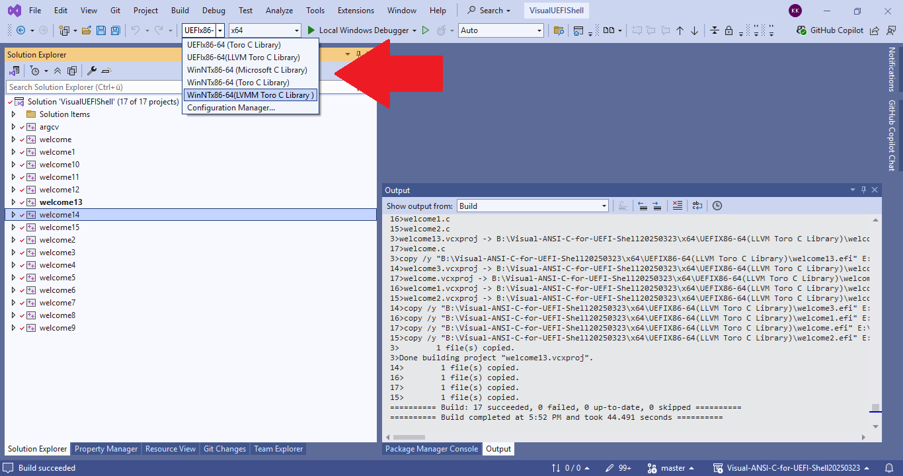

# Visual ANSI C for UEFI Shell
Getting started with Visual Studio 2019 for UEFI Shell and ANSI C cross-development.

## Projects/sample programs
| Project   |      Description      |
|:----------|:-------------|
|[ARGCV](argcv)   |argument count, argument vector, command line arguments|
|[WELCOME](welcome)   |simple `Hello, world`|
|[WELCOME1](welcome1)   |simple `Hello, world` using `puts()`|
|[WELCOME2](welcome2)   |simple `Hello, world` using `fprintf()` to STDERR and STDOUT each|
|[WELCOME3](welcome3)   |simple `Hello, world` using `fputs()` to STDERR and STDOUT each|
|[WELCOME4](welcome4)   |simple `Hello, world` using `fwrite()` to STDERR and STDOUT each|
|[WELCOME5](welcome5)   |simple `Hello, world` using `putc()` to STDERR and STDOUT each|
|[WELCOME6](welcome6)   |simple `Hello, world` using `fputc()` to STDERR and STDOUT each|
|[WELCOME7](welcome7)   |simple `Hello, world` using all possible functions to STDOUT only|
|[WELCOME8](welcome8)   |simple `Hello, world` for KARAOKE purpose|
|[WELCOME9](welcome9)   |demonstration of `CTRL-C`and haow to catch it in a ANSI/STANDARD C program|
|[WELCOME10](welcome10) |demonstration *global Classes* in C++|
|[WELCOME11](welcome11) |simple `Hello, world` using UEFI API `SystemTable->ConOut->OutputString(SystemTable->ConOut`|

## Binaries
[EFI Binaries](https://github.com/KilianKegel/Visual-ANSI-C-for-UEFI-Shell/tree/master/x64/UEFIx86-64%20(Torito%20C%20Library)) 
[NT64/Torito Binaries](https://github.com/KilianKegel/Visual-ANSI-C-for-UEFI-Shell/tree/master/x64/WinNTx86-64%20(Torito%20C%20Library)) 
[NT64/MSFT Binaries](https://github.com/KilianKegel/Visual-ANSI-C-for-UEFI-Shell/tree/master/x64/WinNTx86-64%20(Microsoft%20C%20Library)) 

## HowTo
https://github.com/KilianKegel/HowTo-setup-an-UEFI-Development-PC#howto-setup-an-uefi-development-pc

# Revision history
https://github.com/KilianKegel/torito-C-Library#revision-history
### 20200208
* add "Hello, World"-Example (https://github.com/KilianKegel/Visual-ANSI-C-for-UEFI-Shell/blob/master/welcome11/welcome11.c) 
  using the native UEFI API ("https://uefi.org/sites/default/files/resources/UEFI_Spec_2_7.pdf#page=598")
### 20200204/R154
* Update to torito-C 20200204/R154
* adjust solution configurations
* update copyright
### 20191216/R152
* Update to torito-C 20191126/R152
* improve C++ global object initialization (introduced in 20181129/R116) to have full
  ANSI C library function set available during invocation of global constructors before main()
  https://docs.microsoft.com/en-us/cpp/c-runtime-library/reference/initterm-initterm-e?view=vs-2017 
  https://github.com/KilianKegel/Visual-ANSI-C-for-UEFI-Shell/blob/master/welcome10/welcome10.cpp
* increase number of possible ATEXIT() registrations to 32 + 4 to allow 4 additional C++ destructor registrations
### 20191210
* update to VS2019 Version 16.4.0 (Spectre Support)
* intern: change configuration naming
    * UEFIx86-64 (Torito C Library)
    * WinNTx86-64 (Torito C Library)
    * WinNTx86-64 (Microsoft C Library)
### 20191126/R149
* Update to torito-C 20191126/R149
### 20191111/R146
* Update to torito-C 20181111/R146
* add missing intrinsic functions _difftime64() and _gmtime64() required by Microsoft Compiler
* fixed mktime() to crash with invalid time/date before 01/01/1970 00:00:00
### 20191017/R141
* add CTRL-C support 
  NOTE: CTRL-C is implemented on Signal handling `<signal.h>` interface and can be catched and supressed
        by the application. https://github.com/KilianKegel/Visual-ANSI-C-for-UEFI-Shell/blob/master/welcome9/welcome9.c
* fixed `system()` library function does not workaround completely the EfiShellProtocol->Execute() bug
  to display the drive mappings, when multipartition ("BLK10") mass storage device is attached
* implement UEFI Shell compatibility mode for STDOUT and STDERR to allow I/O redirection `>a` for ASCII and `>` for UCS-2/UTF16
* add build switch `char _gSTDOUTMode;   /* 0 == UEFI Shell default, 1 == ASCII only */` to force TORITO C backward compatibility ( ASCII mode only )
### 20190922/R138
* Update to torito-C 20190621/R138 that autodetects I/O redirection UTF16 vs. ASCII
* add support for VS2019 ver 16.2.5
### 20190918/R137
* update to VS2019 Version 16.2.5 (Spectre Support)
### 20190621/R133
* Update to torito - C 20190621 / R133 that adds VS2019 support, remove library dependancy from compiler version
### 20190410/R126
* Update to torito - C 20190410 / R126 that provides various improvements
### 20190109/R123
* Update to torito-C 20190108/R123 that provides various improvements
### 20181216/R119
* Update to torito-C 20181216/R119 that provides various improvements
* add "WinNTx86-64 (Microsoft C Library)" solution configuration. 
  Previously only "UEFIx86-64 (Torito C Library)" and "WinNTx86-64 (Torito C Library)"
  For varification projects can be linked against the original Microsoft C library and the Torito C Library
* Update WindowsTargetPlatformVersion to  10.0.17134.0 from 10.0.16299.0
### 20181129/R116
* Update to torito-C 20181129/R116 that provides various improvements
### 20181112/R110
* Update to torito-C 20181112/R110 that provides scanf-family improvements
### 20180921/R107
* Update to torito-C 20180920/R106 that provides VS2017/15.8 support
* cleanup project settings, remove default C library from solution/project view
### 20180830/R102
* Update to torito-C 20180830/R102
### 20180817
* add UDK2018 MdePkg includes to enable acces to UEFI API
* fixed structure alignment to default / 8 byte alignment
### 20180717/R101
* Update to torito-C 20180717/R101
### 2018041/R95
* Update to torito-C 20180411/R95
### 20180130/R86
* Update to torito-C 20180130/R86
### 20180108/R85
* Update to torito-C 20180108/R85
### 20171105/R78
* initial revision

